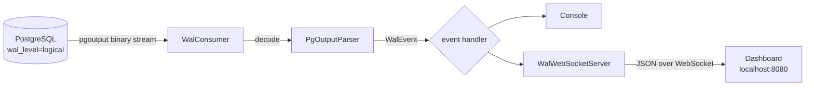

# wal-meow

A tiny Java tool that taps directly into PostgreSQL's **logical replication (WAL)**
stream and turns every `INSERT` / `UPDATE` / `DELETE` into a live event — printed
to the console and pushed to a built-in web dashboard in real time.

<p>
  
  
  
</p>

## Why this exists

Normally, seeing what changes in a database as it happens means either polling
it yourself or standing up heavyweight Change Data Capture infrastructure
(Debezium, Kafka Connect, …). **wal-meow** is the minimal version of that idea:
it speaks Postgres's `pgoutput` logical replication protocol directly — no
external broker, no extra services — and turns the raw binary WAL stream into
readable events you can watch live in a browser.

It's useful for:
- **Learning** how PostgreSQL logical replication / `pgoutput` actually works under the hood.
- **Debugging** — watch exactly what a service is writing to the database, live, without adding logging to that service.
- **A starting point** for lightweight real-time features (activity feeds, audit trails, cache invalidation) without pulling in a full CDC stack.

## What it looks like

Open the dashboard and every database change shows up as a plain-language card —
not a raw log line:

> ➕ **public.applications** was **inserted** — a new row was inserted · transaction #774
>
> ✏️ **public.applications** was **updated** — a row was updated · transaction #775 *(click to expand and see the before/after diff)*

Insertions, updates, and deletions are color-coded, filterable, and update live
over a WebSocket — no page refresh needed. Internal transaction markers (`BEGIN`
/ `COMMIT`) are hidden from the UI; they're just noise for a human observer.

## How it works



1. **`WalConsumer`** opens two connections to Postgres: a normal SQL connection
   (used to make sure a `PUBLICATION` and a replication `SLOT` exist) and a
   dedicated **replication connection** speaking the logical replication wire
   protocol.
2. It streams raw `pgoutput` messages and hands each buffer to
   **`PgOutputParser`**, which decodes `BEGIN` / `COMMIT` / `RELATION` /
   `INSERT` / `UPDATE` / `DELETE` messages into a typed **`WalEvent`**.
3. Every event goes to a simple handler that both prints it to the console and
   broadcasts it as JSON to **`WalWebSocketServer`** — an embedded Jetty server
   that serves the dashboard (`/`) and pushes live updates over a WebSocket
   (`/ws`).

## Requirements

- **JDK 21** — the build is pinned to it via a Gradle toolchain, so as long as
  *some* JDK 21 is installed, Gradle will find and use it automatically.
- **Docker** (to run the bundled PostgreSQL 16 via `docker-compose`) — or point
  it at your own Postgres 16+ instance with logical replication enabled.
- Nothing else — the Gradle wrapper is included, no local Gradle install needed.

## Getting started

```bash
# 1. Start PostgreSQL (wal_level=logical is enabled by default in the image)
docker compose up -d

# 2. Run the app
./gradlew run
```

Then open **http://localhost:8080** — the dashboard connects automatically and
starts listening. Make a change in the database and watch it appear instantly:

```bash
docker exec -it postgres_db psql -U db -d db -c \
  "CREATE TABLE demo(id serial primary key, note text);
   INSERT INTO demo(note) VALUES ('hello wal-meow');"
```

A ready-made script with a more realistic example (INSERT / UPDATE / DELETE,
including non-ASCII text) is included:

```bash
docker exec -i postgres_db psql -U db -d db -f - < test_wal.sql
```

## Configuration

Everything currently lives in code rather than a config file, on purpose (this
is a small, self-contained tool):

- **Database connection** — `src/main/java/org/cihan/WalConsumer/WalConsumerConfig.java`
  (defaults match `docker-compose.yml`: `localhost:5432/db`, user/password `db`).
- **Dashboard port** — `DASHBOARD_PORT` in `src/main/java/org/cihan/Main.java` (default `8080`).
- **Replication slot / publication names** — constants at the top of `WalConsumer.java`.

## Project layout

```
src/main/java/org/cihan/
├── Main.java                    entry point — wires everything together
├── WalConsumer/
│   ├── WalConsumer.java         connects, manages the slot/publication, reads the WAL stream
│   └── WalConsumerConfig.java   database connection settings
├── model/
│   ├── WalEvent.java            a single decoded change (insert/update/delete/...)
│   └── RelationInfo.java        cached table/column metadata (from RELATION messages)
├── parser/
│   └── PgOutputParser.java      decodes the raw pgoutput binary protocol
└── websocket/
    └── WalWebSocketServer.java  embedded Jetty server: dashboard + live WebSocket feed
src/main/resources/static/
└── index.html                   the dashboard (single self-contained page)
```

## Notes & limitations

This is a learning/demo-scale project, not production tooling — a few things
to keep in mind if you build on it:

- Database credentials are hardcoded for local development (matching
  `docker-compose.yml`); swap `WalConsumerConfig` for environment variables
  before pointing this at anything real.
- One publication (`FOR ALL TABLES`) and one replication slot are used for the
  whole database — there's no per-table filtering yet.
- The replication slot keeps accumulating WAL on the server as long as it
  exists and isn't consumed, even if the app isn't running — drop it with
  `SELECT pg_drop_replication_slot('wal_watcher_slot');` if you're done
  experimenting and don't want Postgres retaining WAL indefinitely.
